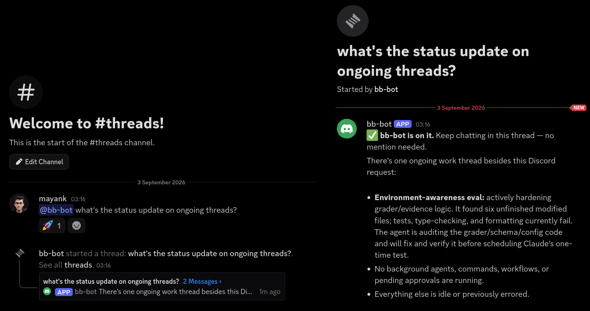
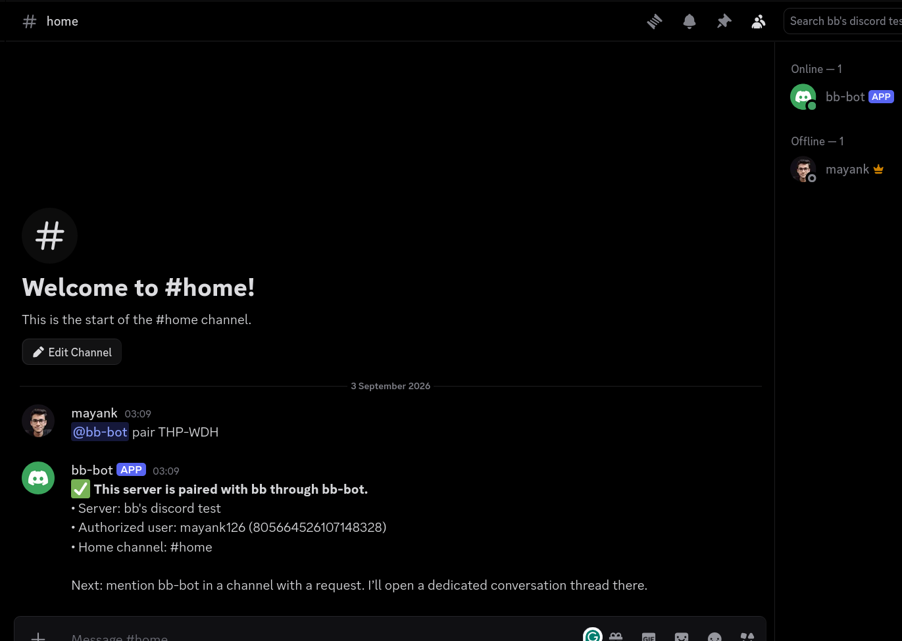
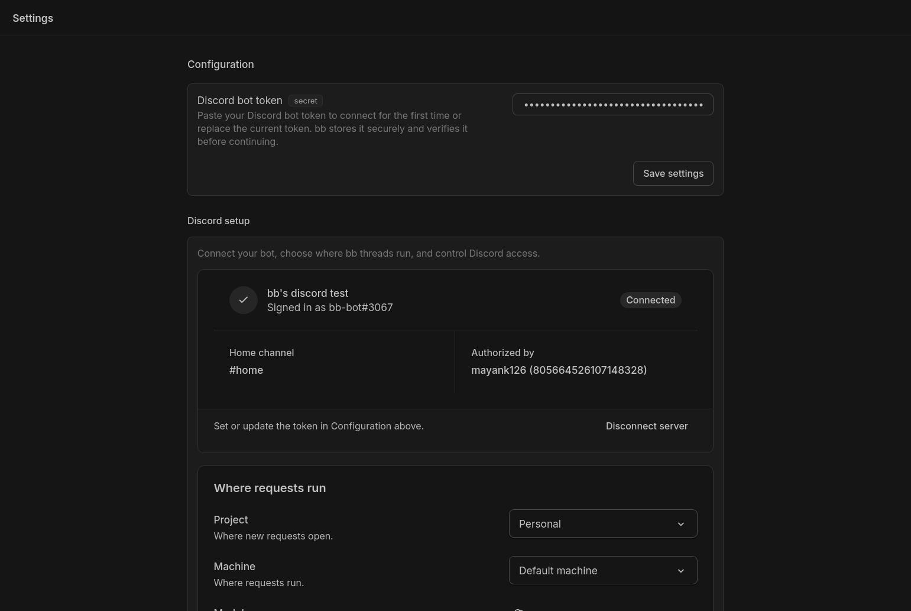

# Discord for bb

Run bb agent threads from Discord. Mention your bot to start a dedicated conversation, continue in the Discord thread without mentioning it again, answer bb questions and approvals, and receive the result where the conversation started.

With optional full server access, bb agents can also read and manage the paired Discord server through permission-gated tools.

## Demo

### Run bb from a Discord conversation

Mention the bot in a channel to start a dedicated thread, then keep chatting
there while bb works and reports back.



### Pair your Discord server

Create a one-time pairing code in bb and send it to the bot in the server you
want to connect.



### Configure everything in bb

Choose the project, machine, model, permission mode, channels, and Discord
server access from the plugin settings page.



## Install

Discord for bb requires bb 0.40.0 or later.

After its marketplace launch, install it from bb's Extensions page. To install the current repository directly:

```sh
bb plugin install git:https://github.com/MayankBansal12/bb-plugin-discord.git@main
```

For development, clone the repository and install the local checkout instead:

```sh
npm ci
bb plugin install .
```

## Set up Discord

Initial pairing happens in bb and Discord. You do not need Discord Developer Mode or any copied server, channel, or user IDs.

### 1. Create a Discord bot

1. Open the [Discord Developer Portal](https://discord.com/developers/applications) and create an application.
2. Open **Bot**, create the bot if needed, and copy or reset its token.
3. Enable **Message Content Intent**.
4. Optional: enable **Server Members Intent** if you want agents to list server members.

Keep the token private. Anyone with it can operate the bot.

### 2. Add the token in bb

Open **Settings → Extensions → Plugins → Discord** in bb, paste the token into **Discord bot token**, and save it. bb stores the token as a secret and verifies it with Discord before showing the remaining setup steps.

### 3. Invite and pair the bot

Once the token is verified, the **Discord setup** section shows the bot identity and guides you through pairing:

1. Select **Invite to Discord** and add the bot to the server you want to connect.
2. Copy the one-time pairing command shown in bb.
3. Send that exact command in the Discord channel you want to use for status and failure alerts.

The command looks like this, using your bot's real user ID and a six-character code:

```text
<@123456789012345678> pair ABC-123
```

The code is single-use and expires after ten minutes. Pairing authorizes the server, the person who sent the command, and that channel as the default home channel. A server cannot claim the bot before an operator creates the code in bb.

The default invite includes the permissions needed to create and reply inside public Discord threads. If the bot was invited before those permissions were added, use the invite link again or update the bot's Discord role.

### Terminal setup

The same flow is available through the bb CLI:

```sh
bb discord pair
```

The command prints the invite URL and the exact pairing command to send in Discord. Useful follow-up commands:

```sh
bb discord status
bb discord invite
bb discord allow <discord-user-id>
bb discord revoke <discord-user-id>
bb discord unpair
```

`bb discord status` never prints the active pairing code. Run `bb discord pair` when you explicitly need to reveal or refresh it.

## Start a conversation

Mention the bot with a request in a normal channel:

```text
@your-bot inspect the failing login tests
```

The plugin creates a dedicated Discord thread and a linked bb thread. A 🚀 reaction confirms that the session is ready. Continue inside the Discord thread; authorized users do not need to mention the bot again.

Unmentioned messages in parent channels are ignored. Mention the bot again in a parent channel whenever you want a separate conversation. Mentions inside unrelated Discord threads are ignored so the bot does not attach itself to an existing discussion by accident.

### Questions and approvals

Reply normally when bb asks one question. For several questions, use numbered lines:

```text
1: feature/discord
2: run the full suite
```

Approval requests include Discord buttons for every decision bb offers. Depending on the request, choose **Approve once**, **Allow for session**, or **Deny**. “Allow for session” grants only the requested permission for the current provider session; it does not enable unrestricted full access.

Text replies remain available as a fallback:

```text
approve
approve session
deny
```

When several approvals are pending, use the buttons on the exact request or open the conversation in bb. Plain-text replies are intentionally not guessed in that situation.

## Choose where requests run

Open **Settings → Extensions → Plugins → Discord** in bb after pairing to choose the project, machine, model, permission mode, and channel behavior for new Discord conversations.

Project, machine, and model form one execution choice:

- The project selects the checkout and defaults to your personal project.
- The machine selects the enrolled computer and defaults to the project's machine.
- The model list comes from providers available on that machine and defaults to the project's model.

Changing the machine resets a pinned model because model availability belongs to the machine. The plugin validates this choice again for every Discord request. An offline machine, unavailable model, signed-out provider, or missing project checkout produces an actionable error instead of silently switching execution targets.

| Setting | Default | What it controls |
|---|---|---|
| Project | Personal project | The checkout and project defaults used by new bb threads. |
| Machine | Project default | The enrolled machine that runs new requests. |
| Model | Project default | The provider, model, reasoning level, and service tier. |
| bb permission mode | Machine default | Follows the selected machine's access limit; falls back to `full` if the limit cannot be read. |
| Discord access | Messages only | Which Discord tools bb agents receive. |
| Destructive actions | Off | Whether full-access agents may delete channels or moderate members. |
| Status and alerts | Pairing channel | Where connection and failure notices are posted. |
| New conversations | Any channel | Optionally restricts where a mention can start a new session. |

Optional channel overrides use Discord channel IDs. Initial pairing itself does not require them.

## Security model

This plugin can start agent work on a machine running bb. Treat access to the paired bot like shell access.

- Pairing requires a short-lived code created inside bb.
- Only the paired server is accepted.
- Only the person who paired and explicitly allowlisted users can drive bb.
- New conversations require an explicit bot mention.
- Discord-started threads use the selected machine's access limit by default. If that value cannot be read, the plugin requests `full`; bb still enforces the machine's permission ceiling when the thread starts.
- The bot token stays in bb's permission-restricted plugin secret store. The frontend receives only a fixed mask and the final four characters.
- Prompts are capped at 8,000 characters, and Discord message IDs are deduplicated.
- Discord-started threads use the personal project unless you explicitly choose another project. There is no “first available project” fallback.

Permission modes:

- `machine-default` follows the selected machine's access limit and falls back to `full` when that value is unavailable.
- `auto` keeps workspace sandboxing and lets bb decide when approval is required.
- `accept-edits` asks the user to review escalations.
- `full` bypasses sandboxing and approval prompts when the machine also permits it.
- `project-default` inherits the project's permission mode.

## Discord tools

Once paired, bb threads can use tools against the paired server. Tool availability follows the access level saved in the plugin settings.

Discord-backed conversations do not receive `discord_send_message`: their normal assistant reply is already delivered automatically to the dedicated Discord thread. This prevents a reply from being cross-posted to the parent channel and then echoed again in the thread. Other bb threads can still use the send tool normally.

### Messages only

This least-privilege default can inspect the server and work with messages and threads.

| Tool | Action |
|---|---|
| `discord_server_info` | Summarize the paired server. |
| `discord_list_channels` | List channels, categories, and topics. |
| `discord_read_channel` | Read recent messages from a channel or thread. |
| `discord_send_message` | Send a message to a channel or thread. |
| `discord_create_thread` | Create a public thread under a text channel. |

### Full server access

Full access adds server administration tools:

| Tool | Action |
|---|---|
| `discord_list_roles` | List server roles. |
| `discord_list_members` | List members through Discord's REST API. |
| `discord_create_channel` | Create text, voice, category, announcement, forum, or stage channels. |
| `discord_edit_channel` | Rename a channel, update its topic, or set slow mode. |
| `discord_manage_member_role` | Add or remove a member role. |

Re-invite the bot with `bb discord invite --full` after enabling full access so Discord grants the additional permissions.

### Destructive actions

These tools appear only when **Discord access** is set to **Full server access** and **Destructive actions** is enabled separately:

| Tool | Action |
|---|---|
| `discord_delete_channel` | Permanently delete a channel and its history. |
| `discord_moderate_member` | Kick, ban, or time out a member. |

Destructive calls require an explicit confirmation argument. Administrative calls include the originating bb thread ID in Discord's audit log.

## Troubleshooting

- **Discord rejects the token:** reset it on the Developer Portal's **Bot** page, then replace it in bb.
- **The gateway closes with code 4014:** enable **Message Content Intent** for the application.
- **Messages arrive without text:** enable **Message Content Intent**, then restart bb.
- **Member listing fails:** enable **Server Members Intent**. The gateway does not subscribe to member events, and other tools continue to work.
- **The bot cannot create or reply in threads:** use the invite link again or grant **Create Public Threads** and **Send Messages in Threads** to the bot's role.
- **A machine or model is unavailable:** update **Where requests run** in the Discord plugin settings.

Saving a replacement token reconnects the gateway without `bb plugin reload`. Network reconnects use exponential backoff from two seconds up to one minute.

Inspect plugin health and logs with:

```sh
bb discord status
bb plugin list
bb plugin logs discord -n 100
```

## Development

The plugin requires Node.js 22.19 or later for local development.

```sh
npm ci
npm run check
```

`npm run check` typechecks every TypeScript source and test, runs the complete test suite, verifies the vendored declarations against the installed bb SDK, and builds the server and app artifacts.

For a live development loop:

```sh
bb plugin install .
bb plugin dev
```

The Discord gateway runs as a supervised `bb.background.service`. Pairing state, deduplication records, configuration, and Discord-thread ↔ bb-thread mappings live in the plugin's SQLite database.

## Current limitations

- One paired Discord server per plugin installation.
- One or more explicitly authorized Discord users.
- Replies are sent per turn rather than streamed token by token.
- Plain text, bb questions, and bb approvals are bridged; other interaction types may still require opening bb.
- Per-channel project routing is not available; all new Discord conversations use the plugin's configured project.
